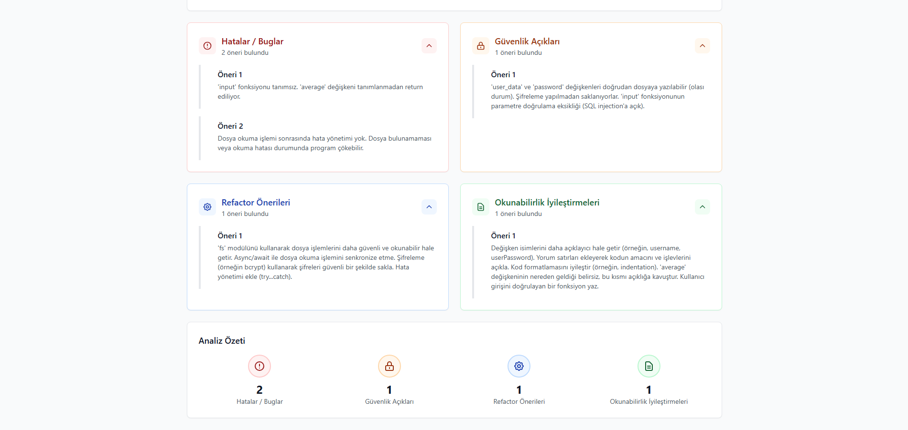
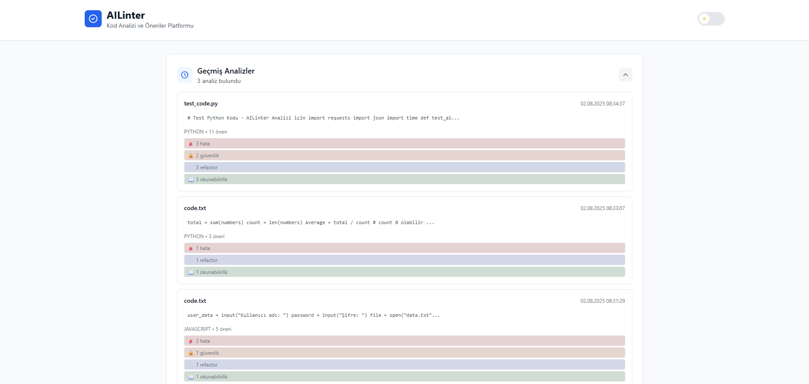

# AILinter - AI-Powered Code Analysis Platform

A modern, user-friendly code analysis platform that leverages Google Gemini AI to analyze your code and provide comprehensive feedback on errors, security vulnerabilities, refactoring suggestions, and readability improvements.

## 🚀 Features

- **4-Category Analysis**: Errors, Security, Refactoring, Readability
- **Multi-Language Support**: JavaScript, Python, Java, C++, C#, PHP and more
- **Modern UI/UX**: Day/Night theme support
- **History Management**: View and compare previous analyses
- **File Upload**: Direct code file upload capability
- **Real-time Analysis**: Fast and detailed results
- **Docker Containerization**: Easy deployment with Docker Compose

## 🏗️ Project Structure

```
AILinter/
├── frontend/          # React + Tailwind CSS
├── backend/           # FastAPI + Python
├── worker/            # Python Worker Service
├── infra/             # Docker configurations
│   ├── docker-compose.yml
│   ├── env.example
│   └── start.ps1
├── docs/              # Comprehensive documentation
└── README.md
```

## 🏛️ System Architecture


*High-level system architecture showing the interaction between Frontend, Backend, Worker, RabbitMQ, and Redis services*

## 🛠️ Technology Stack

- **Frontend**: React.js, Tailwind CSS, Axios
- **Backend**: FastAPI, Python 3.11
- **Worker**: Python, Google Gemini API
- **Message Queue**: RabbitMQ
- **Cache**: Redis
- **Containerization**: Docker & Docker Compose
- **Development**: Built with Cursor IDE

## 🐳 Quick Start (Docker) - Recommended

**Use this method for easy setup and development. No need to install Node.js, Python, or other dependencies manually!**

### Prerequisites
- Docker Desktop
- PowerShell (Windows) or Terminal (Mac/Linux)

### Installation

1. **Clone the repository:**
```bash
git clone <repository-url>
cd AILinter
```

2. **Navigate to infra directory:**
```bash
cd infra
```

3. **Create environment file:**
```bash
cp env.example .env
```

4. **Update .env with your Gemini API key:**
```env
GEMINI_API_KEY=your_actual_gemini_api_key_here
```

5. **Start all services with one command:**
```powershell
# Windows
.\start.ps1

# Mac/Linux
docker-compose up -d --build
```

6. **Open in browser:**
```
http://localhost:3000
```

**✅ All services (Frontend, Backend, Worker, Redis, RabbitMQ) start automatically!**

**💡 Docker handles all dependencies - no need for npm install, pip install, or manual setup!**

## 🔧 Manual Installation - Advanced

**Use this method for detailed control and debugging.**

### Prerequisites
- Node.js 18+
- Python 3.11+
- Redis Server
- RabbitMQ Server

### Frontend Setup
```bash
cd frontend
npm install
npm start
```

### Backend Setup
```bash
cd backend
python -m venv venv
# Windows
venv\Scripts\activate
# Mac/Linux
source venv/bin/activate
pip install -r requirements.txt
uvicorn main:app --reload
```

### Worker Setup
```bash
cd worker
python -m venv venv
# Windows
venv\Scripts\activate
# Mac/Linux
source venv/bin/activate
pip install -r requirements.txt
python worker.py
```

**⚠️ Note: You need to start Redis and RabbitMQ separately with manual installation.**

## 🌐 Access Points

- **Frontend**: http://localhost:3000
- **Backend API**: http://localhost:8000
- **API Documentation**: http://localhost:8000/docs
- **RabbitMQ Management**: http://localhost:15672 (guest/guest)

## 🔑 Environment Variables

### Setting Up Environment Variables

1. **Navigate to the infra directory:**
```bash
cd infra
```

2. **Copy the example environment file:**
```bash
cp env.example .env
```

3. **Edit the .env file and add your Gemini API key:**
```env
# Required: Your Google Gemini API key
GEMINI_API_KEY=your_actual_gemini_api_key_here

# Optional: Override default settings (Docker uses these automatically)
REDIS_HOST=redis
REDIS_PORT=6379
RABBITMQ_HOST=rabbitmq
RABBITMQ_PORT=5672
RABBITMQ_USERNAME=guest
RABBITMQ_PASSWORD=guest
RABBITMQ_QUEUE=code_analysis
```

**💡 Note**: Docker Compose automatically reads the `.env` file from the `infra/` directory. No need to create `.env` files in other folders.

### Getting a Gemini API Key

1. Go to [Google AI Studio](https://aistudio.google.com/app/apikey)
2. Sign in with your Google account
3. Click "Create API Key"
4. Copy the generated key
5. Paste it in your `.env` file


## 📝 API Endpoints

- `POST /analyze` - Start code analysis
- `GET /result/{id}` - Get analysis result
- `GET /status/{id}` - Check analysis status
- `GET /health` - Service health check

## 🎨 Theme System

- **Day Mode**: Light theme
- **Night Mode**: Dark theme
- Automatic theme switching

## 📊 Analysis Categories

1. **🚨 Errors/Bugs**: Syntax errors, logic errors
2. **🔒 Security**: Security vulnerabilities, best practices
3. **🔧 Refactoring**: Code improvement suggestions
4. **📖 Readability**: Code readability enhancements

## 📸 Screenshots

### Main Interface

*Code input and file upload interface*

### Analysis Results

*Categorized analysis results with collapsible sections*

### History Page (Dark Mode)

*Analysis history in dark theme*

### History Page (Light Mode)

*Analysis history in light theme*

### File Upload

*Direct file upload functionality*

## 🧪 Testing

### Frontend Tests
```bash
cd frontend
npm test
```

### Backend Tests
```bash
cd backend
pytest
```

## 📚 Documentation

**📖 Available in both Turkish and English!**

For detailed documentation, open [`docs/index.html` (Turkish)](docs/index.html) or [`docs/index-en.html` (English)](docs/index-en.html) in your browser. It includes:

- **System Architecture**: Interactive diagrams with Mermaid.js
- **API Documentation**: Swagger UI integration
- **User Guide**: Step-by-step instructions
- **Screenshots**: Application examples and UI demonstrations
- **Technical Details**: RabbitMQ, Redis, Docker configurations
- **Installation Guide**: Docker and manual setup instructions
- **Testing Guide**: Unit test instructions and reports

### 🌐 Language Support

- **Turkish**: `docs/index.html`
- **English**: `docs/index-en.html`
- **Easy Switching**: Language toggle buttons in both versions

## 🤝 Contributing

1. Fork the repository
2. Create a feature branch (`git checkout -b feature/amazing-feature`)
3. Commit your changes (`git commit -m 'Add amazing feature'`)
4. Push to the branch (`git push origin feature/amazing-feature`)
5. Open a Pull Request

## 📄 License

This project is licensed under the MIT License.

## 💡 Development Note

This project was developed using Cursor IDE, which provided enhanced AI-assisted coding capabilities throughout the development process. 